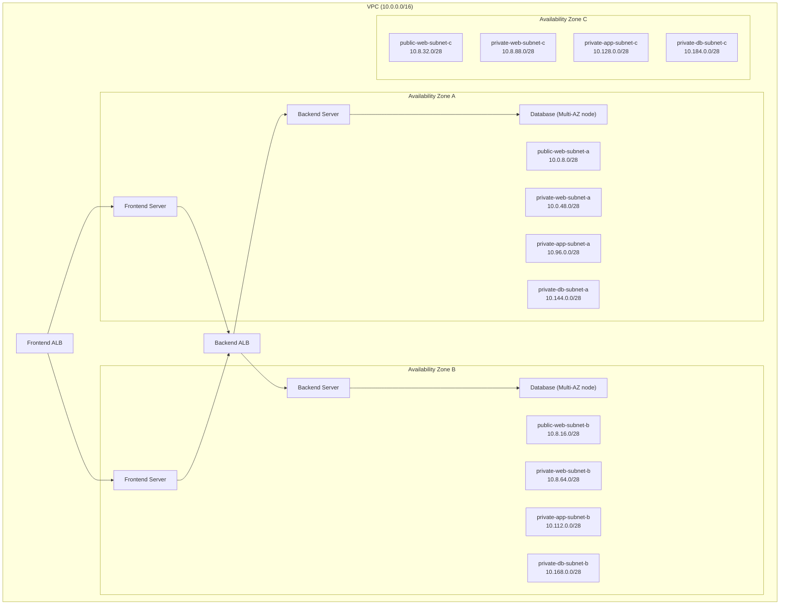
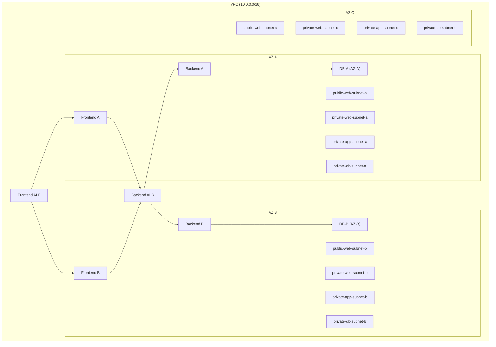

# 🏗 Three-Tier Architecture on AWS  
*Repository:* aws-skill-builder-projects

This project demonstrates how to deploy a *highly available, secure, scalable Three-Tier Architecture* on AWS using VPC, Subnets, Route Tables, ALB, EC2, NAT Gateways, and Database Tier.

The architecture contains:  
- *Web Tier* → Public Subnets  
- *App Tier* → Private Subnets  
- *DB Tier* → Private Subnets (Multi-AZ)  
- *Frontend ALB, **Backend ALB*  
- *NAT Gateway, **IGW*  
- *Security Groups, **Routing, **High-Availability* (3 AZ)

---

## 📌 *Architecture Overview (Mermaid Diagram)*

# 🏗️ AWS Skill Builder Project — Three-Tier Architecture (Symbolic Overview)

## 📌 Project Metadata
- **Name:** aws-skill-builder-projects  
- **Title:** Three-Tier Architecture on AWS  
- **Description:** Highly available, secure, scalable 3-tier architecture using  
  - VPC  
  - Subnets  
  - Route Tables  
  - ALB  
  - EC2  
  - NAT Gateway  
  - RDS Multi-AZ  

---

## 🧱 Architecture Overview
### **Tiers**
- 🔹 Web Tier (Public)  
- 🔹 App Tier (Private)  
- 🔹 Database Tier (Private Multi-AZ)  

### **Components**
- 🌐 Frontend ALB  
- 🔄 Backend ALB  
- 💻 EC2 Frontend Servers  
- 💻 EC2 Backend Servers  
- 🚪 NAT Gateway  
- 🌍 Internet Gateway  
- 🔐 Security Groups  
- 🛣️ Route Tables  

---

## 📊 Mermaid Diagram (Symbolic)

## 📝 Project Steps (Expanded Format)

### Phase 1: VPC and Subnet Setup 🧱
This phase establishes the foundational network environment, ensuring resources are segregated for security and availability.

1.  **Create VPC:**
    * **CIDR:** $10.0.0.0/16$
2.  **Create Subnets (3 AZs: A, B, C for future scaling):**
    * **Public Subnets (Web Tier):** `public-web-subnet-a`, `public-web-subnet-b`, `public-web-subnet-c`.
    * **Private Web Subnets (Application Tier/EC2 Hosts):** `private-web-subnet-a`, `private-web-subnet-b`, `private-web-subnet-c`.
    * **Private App Subnets (Application Tier/EC2 Hosts):** `private-app-subnet-a`, `private-app-subnet-b`, `private-app-subnet-c`.
    * **Private DB Subnets (Database Tier):** `private-db-subnet-a`, `private-db-subnet-b`, `private-db-subnet-c`.

---

### Phase 2: Connectivity & Routing 🛣️
This phase configures how traffic enters the VPC (IGW) and how private resources can access the internet securely (NAT Gateway).

3.  **Create Internet Gateway (IGW):**
    * Create IGW and attach it to the VPC.
4.  **Create NAT Gateway:**
    * Allocate an **Elastic IP (EIP)**.
    * Create **NAT Gateway** in **one** of the **Public Subnets** (e.g., `public-web-subnet-a`).
5.  **Create Route Tables (RT):**
    * **Public Route Table:** Directs $0.0.0.0/0$ to the **Internet Gateway (IGW)**.
    * **Private App Route Table:** Directs $0.0.0.0/0$ to the **NAT Gateway**.
    * **Private DB Route Table:** Has **no** default route ($0.0.0.0/0$) to ensure complete isolation.
6.  **Associate Route Tables with Subnets:**
    * Associate **Public RT** with **Public Subnets**.
    * Associate **Private App RT** with **Private App Subnets**.
    * Associate **Private DB RT** with **Private DB Subnets**.

---

### Phase 3: Security Groups and EC2 Setup 💻
This phase defines the network security boundaries and prepares the compute resources using Auto Scaling for resilience.

7.  **Create Security Groups (SG):**
    * **`frontend_alb_sg`:** Allow **HTTP 80** from $0.0.0.0/0$ (Internet).
    * **`frontend_server_sg`:** Allow **HTTP 80** only from **`frontend_alb_sg`**.
    * **`backend_alb_sg`:** Allow **HTTP 80** only from **`frontend_server_sg`**.
    * **`backend_server_sg`:** Allow **HTTP 80** only from **`backend_alb_sg`**.
    * **`database_sg`:** Allow DB Port (e.g., $3306$ for MySQL) only from **`backend_server_sg`**.
8.  **EC2 Launch Templates and Auto Scaling:**
    * Create **Launch Templates** for Frontend and Backend servers (including necessary **IAM roles**).
    * Create **Auto Scaling Groups (ASG)** for:
        * **Frontend Servers:** Use Private Web Subnets/Public Web Subnets (depending on design).
        * **Backend Servers:** Use Private App Subnets.

---

### Phase 4: Load Balancers and Database 💾
This phase connects the tiers using ALBs and establishes the highly available database.

9.  **Create Application Load Balancers (ALB):**
    * **Frontend ALB:** Place in **Public Subnets**. Target Group is the Frontend Server ASG.
    * **Backend ALB:** Place in **Private App Subnets**. Target Group is the Backend Server ASG.
10. **Create RDS Multi-AZ Database:**
    * Create a **DB Subnet Group** using the **Private DB Subnets**.
    * Launch the RDS instance (e.g., MySQL, PostgreSQL) into the DB Subnet Group, enabling **Multi-AZ deployment**.
    
