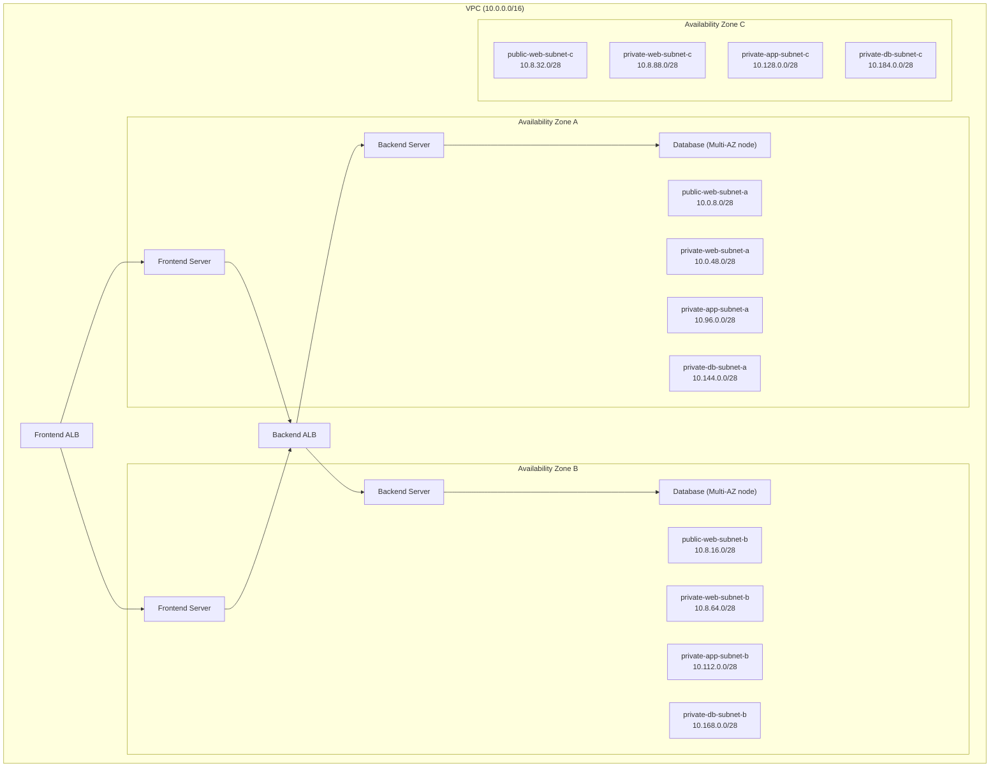
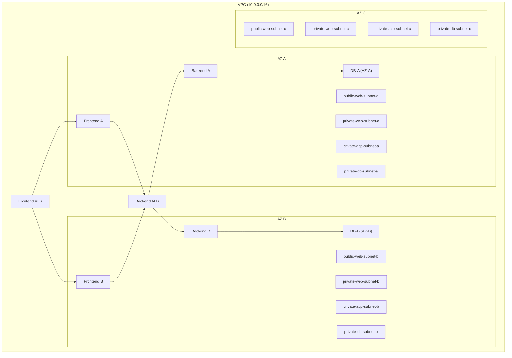

# 🏗 Three-Tier Architecture on AWS  
*Repository:* aws-skill-builder-projects

This project demonstrates how to deploy a *highly available, secure, scalable Three-Tier Architecture* on AWS using VPC, Subnets, Route Tables, ALB, EC2, NAT Gateways, and Database Tier.

The architecture contains:  
- *Web Tier* → Public Subnets  
- *App Tier* → Private Subnets  
- *DB Tier* → Private Subnets (Multi-AZ)  
- *Frontend ALB, **Backend ALB*  
- *NAT Gateway, **IGW*  
- *Security Groups, **Routing, **High-Availability* (3 AZ)

---

## 📌 *Architecture Overview (Mermaid Diagram)*

# 🏗️ AWS Skill Builder Project — Three-Tier Architecture (Symbolic Overview)

## 📌 Project Metadata
- **Name:** aws-skill-builder-projects  
- **Title:** Three-Tier Architecture on AWS  
- **Description:** Highly available, secure, scalable 3-tier architecture using  
  - VPC  
  - Subnets  
  - Route Tables  
  - ALB  
  - EC2  
  - NAT Gateway  
  - RDS Multi-AZ  

---

## 🧱 Architecture Overview
### **Tiers**
- 🔹 Web Tier (Public)  
- 🔹 App Tier (Private)  
- 🔹 Database Tier (Private Multi-AZ)  

### **Components**
- 🌐 Frontend ALB  
- 🔄 Backend ALB  
- 💻 EC2 Frontend Servers  
- 💻 EC2 Backend Servers  
- 🚪 NAT Gateway  
- 🌍 Internet Gateway  
- 🔐 Security Groups  
- 🛣️ Route Tables  

---

## 📊 Mermaid Diagram (Symbolic)

project_steps:
  - step: "Create VPC"
    details: "CIDR block 10.0.0.0/16"

  - step: "Create Subnets"
    web_public:
      - public-web-subnet-a
      - public-web-subnet-b
      - public-web-subnet-c
    web_private:
      - private-web-subnet-a
      - private-web-subnet-b
      - private-web-subnet-c
    app_private:
      - private-app-subnet-a
      - private-app-subnet-b
      - private-app-subnet-c
    db_private:
      - private-db-subnet-a
      - private-db-subnet-b
      - private-db-subnet-c

  - step: "Create Route Tables"
    route_tables:
      - Web Public Route Table
      - Web Private Route Table (1a, 1b, 1c)
      - App Private Route Table (1a, 1b, 1c)
      - DB Private Route Table (1a, 1b, 1c)

  - step: "Associate Route Tables with Subnets"

  - step: "Create Internet Gateway"
    action:
      - Create IGW
      - Attach IGW to VPC

  - step: "Create NAT Gateway"
    action:
      - Create NAT in public subnet
      - Allocate Elastic IP

  - step: "Add Routes"
    public_routes:
      - "0.0.0.0/0 → IGW"
    private_routes:
      - "0.0.0.0/0 → NAT Gateway"

  - step: "Create Security Groups"
    security_groups:
      frontend_alb_sg:
        - allow HTTP 80 from anywhere
      frontend_server_sg:
        - allow HTTP 80 from frontend ALB
      backend_alb_sg:
        - allow HTTP 80 from frontend servers
      backend_server_sg:
        - allow HTTP 80 from backend ALB
      database_sg:
        - allow DB port only from backend servers

components_used:
  networking:
    - VPC
    - Public Subnets
    - Private Web Subnets
    - Private App Subnets
    - Private DB Subnets
    - Route Tables
    - Internet Gateway
    - NAT Gateway
  compute:
    - EC2 Frontend Servers
    - EC2 Backend Servers
    - Frontend ALB
    - Backend ALB
  database:
    - RDS Multi-AZ
  security:
    - Security Groups
    - IAM Roles
    - NACL (optional)

learning_outcomes:
  - Multi-AZ VPC design
  - Subnet tiering & separation
  - NAT vs IGW routing
  - ALB load balancing flows
  - Backend communication logic
  - RDS Multi-AZ reliability
  - AWS security best practices

aws-skill-builder-projects/
├── three-tier-architecture/
│   ├── README.md
│   ├── diagrams/
│   │   └── architecture.png
│   ├── terraform/
│   ├── cloudformation/
│   └── notes/
└── future-projects/

future_enhancements:
  - Terraform automation
  - CloudFormation templates
  - Auto Scaling
  - CloudFront + WAF
  - CloudWatch monitoring
  - CI/CD Pipeline
